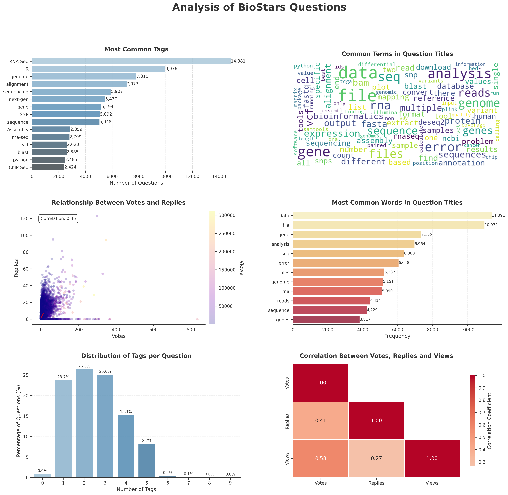
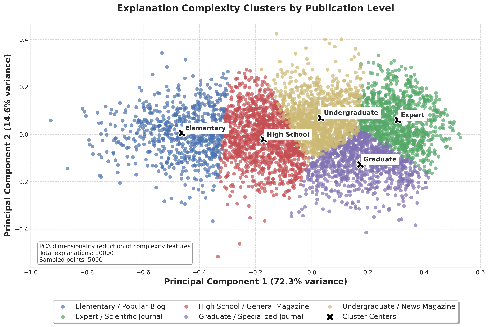
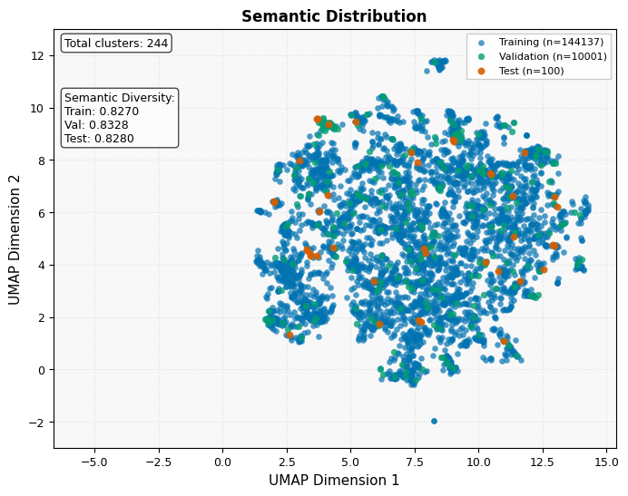

# A Pipeline to Fine-Tune LLM for Bioinformatics Dataset: Use Case Biostars Questions & Answers Forum

This project fine-tunes several large language models (LLMs) on posts from the [Biostars forum](https://www.biostars.org/), a community-driven Q&A platform focused on bioinformatics.

Project's features include:

- Downloading the posts from Biostars
- Extracting content from images embedded in posts
- Converting the posts into markdown format
- Transforming the markdown content into question-answer pairs for each post using [Google's AI](https://cloud.google.com/document-ai/docs/overview)
- Analyzing the complexity of the dataset
- Fine-tuning the model on a test set
- Comparing results with other baseline models

## Why Fine-Tune on Bioinformatics Data?

Bioinformatics data is rich in specialized terminology and workflows but is often sensitive and cannot leave secure environments. Fine-tuning LLMs locally ensures privacy while enabling domain-specific understanding.

Using Biostars as a case study, this pipeline demonstrates how to:

- Extract expert knowledge from community forums
- Enable secure, local model training
- Improve domain-specific comprehension and performance

While Google’s AI tools are used for initial QA generation, the pipeline supports alternatives like Llama-3, Mistral, or Phi-4 for fully local, private implementations.

## Features of the Project

- Novel Methodological Pipeline
- Bioinformatics Knowledge Capture
- Quality Evaluation Framework
- Innovation in Data Processing
- [Dataset Contribution](https://huggingface.co/datasets/muhammadmuneeb007/BioStarsDataset)
- Comparative Model Analysis
- Hyperparameter Optimization
- Educational Value

## Step 1: Download Questions List from BioStars

### Script: `Step1-GetQuestionsListFromBioStars.py`

This script scrapes the Biostars website to collect a list of questions with metadata.

#### Usage:

```bash
python Step1-GetQuestionsListFromBioStars.py
```

#### Output:

```bash
biostars_all_questions.csv
```

The script generates a CSV file containing information about questions from BioStars, including:

| QuestionCount | Votes | Replies | Views | Title                                                                                                     | URL                                 | Tags                                     | Updated_Year |
| ------------- | ----- | ------- | ----- | --------------------------------------------------------------------------------------------------------- | ----------------------------------- | ---------------------------------------- | ------------ |
| 1             | 0     | 1       | 222   | Question about `vg construct`                                                                             | https://www.biostars.org/p/9610704/ | vg                                       |              |
| 2             | 0     | 0       | 45    | How can I use mcmcglmm to calculate whether two traits are correlated?                                    | https://www.biostars.org/p/9610892/ | glmm\|statistics\|evolution              |              |
| 3             | 0     | 1       | 140   | DiffBind normalization error: invalid argument type (list) - cannot make it work everything seems correct | https://www.biostars.org/p/9610880/ | normalization\|deseq2\|chipseq\|diffbind |              |

### Script: `Step1.1-PerformEDAOnQuestionsFromBioStars.py`

Performs analysis on the questions to identify the most common tags and words in the question titles.

#### Usage:

```bash
python Step1.1-PerformEDAOnQuestionsFromBioStars.py
```

#### Output

The script generates exploratory data analysis on the questions, including common tags and word frequencies:



This analysis helps understand the content distribution and common topics in the BioStars dataset.

## Step 2: Filter Questions Based on Replies

### Script: `Step2-FilterQuestionsFromBioStars.py`

This script filters questions from the dataset based on reply count criteria.

#### Filtering Criteria:

- Minimum votes: 0
- Minimum replies: 1

#### Usage:

```bash
python Step2-FilterQuestionsFromBioStars.py
```

#### Output

```bash
biostars_filtered_questions.csv
```

The script generates a CSV file containing filtered questions that meet the criteria:

| QuestionCount | Votes | Replies | Views | Title                                                                                                     | URL                                 | Tags                                     | Updated_Year | replies |
| ------------- | ----- | ------- | ----- | --------------------------------------------------------------------------------------------------------- | ----------------------------------- | ---------------------------------------- | ------------ | ------- |
| 1             | 0.0   | 1       | 222.0 | Question about `vg construct`                                                                             | https://www.biostars.org/p/9610704/ | vg                                       |              | 1       |
| 3             | 0.0   | 1       | 140.0 | DiffBind normalization error: invalid argument type (list) - cannot make it work everything seems correct | https://www.biostars.org/p/9610880/ | normalization\|deseq2\|chipseq\|diffbind |              | 1       |
| 4             | 1.0   | 7       | 1.4   | FastQC on nanopore data: high proportion of polyA and polyG. Why ?                                        | https://www.biostars.org/p/9589811/ | fastQC\|polyG\|ONT\|nanopore\|polyA      |              | 7       |

## Step 3: Download Each Question Data

### Script: `Step3-DownloadQuestionsData.py`

This script downloads and processes individual questions, their answers, and images. It creates a directory for Questions, and for each question, it creates a subdirectory named after the question ID (e.g., 1, 2, 3, 4, 5), and downloads the HTML content.

- Extracts full question content, answers, and comments
- Downloads and processes images from posts
- Performs OCR on images to extract text content
- Creates both raw and processed markdown files

#### Usage:

```bash
python Step3-DownloadQuestionsData.py
```

#### Output:

```
Scraping question: https://www.biostars.org/p/9484424/
Created directory: Questions/1
Created directory: Questions/1/images
Downloaded image: Questions/1/images/example_image.png
Extracted text from image: [OCR Text: sequence alignment visualization]
Saved question details to Questions/1/Text.md
Saved processed markdown to Questions/1/ProcessedText.md
```

## Step 4: Generate Question/Answer Pairs

### Script: `Step4-GenerateQuestionsLinear.py`

This script filters questions based on criteria and prepares prompts for generating structured question-answer pairs.

#### Process:

- Filters questions based on votes, replies, or tags
- Transforms processed HTML to question-answer pairs using Google Gemini
- Utilizes careful prompt engineering to improve model responses
- Processes 90,000+ questions using 12 threads (taking approximately 1 month)
- Requires Google Gemini API access (used models: "gemini-2.5-flash-preview-04-17" and "gemini-2.0-flash-thinking-exp-01-21") Visit the [Google AI Studio](https://aistudio.google.com/)
- Formats questions into JSON format

For more information on the Gemini API, visit the [official documentation](https://ai.google.dev/docs/gemini_api_overview).

#### Prompt Example:

````python
prompt = f"""
You are an expert in extracting questions and answers from Biostars. Your task is to extract
questions and answers from the Biostars online forum, where users post queries, problems, and images,
and others respond in the form of comments. Some comments may contain accurate answers, and those answers have high upvotes.

  ### **1. Extraction Rules**
  - **Ignore** usernames.
  - **Include** references to external tools or links.
  - **Ignore** the number of likes or dislikes.
  - **Choose** the answer based on the comment with the highest number of upvotes and if upvotes are missing then choose the most appropriate answer based on the discussion.

  - **Provide** the source link for each answer.
  - **If no valid answer is found,** use "-" in the answer section.
  - **Limit to two questions only.**
  - **Use direct instructions** (e.g., "How to do something?" instead of "How does one do something?").
  - **Ensure answers follow an instructional style** (e.g., "To do this, follow these steps...").
  - **Use a conversational tone** (e.g., "You can do this by...") to make the content more engaging. and do not use "I" or "we" in the answer or the user is asking or the user wants.

  ### **2. Output Format**
  - Format the extracted data as a **valid JSON array**:

  ```json
  [
      {{
    "Question1": "General question title?",
    "Explanation": "General explanation based on the discussion overall discussion", 100+ words based on discussion.
    "Source": "{row['URL']}",
    "Answer":YES/NO, **If there is no answer found in explanation put no otherwise yes. **
    "Tags": ["tag1", "tag2"]
      }},
      {{
    "Question2": "Detailed question based on the issue the user is facing?", **it should be a detailed questions based on the user query.**
    "Explanation2": "Detailed explanation of the problem and its solution.", **500+ words based on discussion. Include code and explanation as well**.
    "Source": "{row['URL']}",
    "Answer":YES/NO, **If there is no answer found in explanation put no otherwise yes. **
    "Tags": ["tag1", "tag2"]
      }}
  ]


### **3. Formatting Guidelines**

- Use **Markdown triple backticks** (```) for **code snippets**.
- If applicable, use **tables** for clarity.
- Maintain **proper indentation and spacing** for readability.

### **4. Strict Adherence to Provided Information**

- **Do not fabricate** any details not explicitly found in the provided text.
- Stay strictly within the **scope of the given content**.

### **5. Citations & References**

- At the end of each complete answer, **cite the source** as follows:

`SOURCE LINK: {row['URL']}`

---

### **Text from Discussion:**

{content}

---

"""
````

#### Usage:

```bash
python Step4-GenerateQuestionsLinear.py
```

#### Dataset Overview:

This generates dataset comprises questions and answers extracted from Biostars forum posts. The following steps were taken to process and enhance the content:

- Each question was downloaded in HTML format
- Images within posts were processed using OCR, and the extracted text was appended to the question content
- A Markdown version of each question was created and saved
- The Markdown version was submitted to Google Gemini to generate two questions per post:
  - **Question 1**: A general summary of the user's issue
  - **Question 2**: A detailed technical restatement of the issue

Each generated question is paired with an explanation and metadata based on the original Biostars post.

The dataset is available on HuggingFace: [BioStarsDataset](https://huggingface.co/datasets/muhammadmuneeb007/BioStarsDataset/edit/main/README.md)

##### Field Descriptions

- **Question1**: A general or high-level version of the question
- **Explanation1**: A summarized response generated by Google Gemini
- **Source**: URL linking to the original Biostars post
- **Answer**: `"YES"` if the AI found an answer, `"NO"` if no answer was found
- **Tags**: Topics associated with the question
- **QuestionCount**: Number of generated questions
- **URL**: Redundant copy of the source link
- **Votes**: Vote count on the original post
- **Views**: Number of views the post received
- **Replies**: Number of replies to the post
- **Title**: Title of the Biostars post
- **Question2**: A more technical or detailed rephrasing of the original issue
- **Explanation2**: A comprehensive answer to the detailed question
- **Answer2**: The model's full, detailed answer

> ⚠️ Note: The `Answer` fields reflect whether the model successfully generated a meaningful response (`YES`) or not (`NO`).
> This dataset comprises questions and answers extracted from Biostars forum posts. The following steps were taken to process and enhance the content:

- Each question was downloaded in HTML format
- Images within posts were processed using OCR, and the extracted text was appended to the question content
- A Markdown version of each question was created and saved
- The Markdown version was submitted to Google Gemini to generate two questions per post:
  - **Question 1**: A general summary of the user's issue
  - **Question 2**: A detailed technical restatement of the issue

Each generated question is paired with an explanation and metadata based on the original Biostars post.

##### Field Descriptions

- **Question1**: A general or high-level version of the question
- **Explanation1**: A summarized response generated by Google Gemini
- **Source**: URL linking to the original Biostars post
- **Answer**: `"YES"` if the AI found an answer, `"NO"` if no answer was found
- **Tags**: Topics associated with the question
- **QuestionCount**: Number of generated questions
- **URL**: Redundant copy of the source link
- **Votes**: Vote count on the original post
- **Views**: Number of views the post received
- **Replies**: Number of replies to the post
- **Title**: Title of the Biostars post
- **Question2**: A more technical or detailed rephrasing of the original issue
- **Explanation2**: A comprehensive answer to the detailed question
- **Answer2**: The model's full, detailed answer

> ⚠️ Note: The `Answer` fields reflect whether the model successfully generated a meaningful response (`YES`) or not (`NO`).

#### Sample Output:

````json
{
  "Question1": "Why does `vg construct --alt-paths-plain` cause errors?",
  "Explanation1": "The user is experiencing issues when using the `vg construct` command with the `--alt-paths-plain` option for constructing a variation graph. They are encountering warnings indicating 'missingempty' paths and a mismatch between variants in the VCF file and the constructed graph. The core problem is a mismatch between how variant paths are named when using `--alt-paths-plain` and what the GBWT indexing process expects. This option leads to naming variant paths using variant IDs from the VCF, which is incompatible with GBWT indexing that relies on SHA1 hashes of variants for path naming. Consequently, GBWT indexing fails to locate the correct paths, resulting in errors and warnings during the indexing step.",
  "Source": "https://www.biostars.org/p/9610704/",
  "Answer": "YES",
  "Tags": [
    "vg"
  ],
  "QuestionCount": "1",
  "URL": "https://www.biostars.org/p/9610704/",
  "Votes": 0.0,
  "Views": 222.0,
  "Replies": 1,
  "Title": "Question about vg construct"
},
{
  "Question2": "How to resolve 'missingempty' path errors when using `vg construct --alt-paths-plain` and use VCF ID column instead of SHA1 hash?",
  "Explanation2": "The 'missingempty' path errors encountered when using `vg construct --alt-paths-plain` arise because the GBWT indexing process, used in commands like `vg index -G test.gbwt`, expects variant paths to be named based on the SHA1 hash of the variant, not the VCF ID. The `--alt-paths-plain` option instructs `vg construct` to name variant paths using the IDs directly from the VCF file. This naming convention is incompatible with GBWT, which is designed to work with hash-based path names. \n\n**Solution:**\n\nTo resolve this issue and avoid the errors, you should **remove the `--alt-paths-plain` option** from your `vg construct` command. By default, or when using `--alt-paths` (which is often implicit), `vg construct` will name variant paths using the SHA1 hash of the variant. This hash-based naming is compatible with the GBWT indexing process. \n\n```bash\n# Corrected vg construct command:\nvg construct --reference ref.fa --vcf test.vcf.gz --alt-paths --handle-sv --flat-alts --progress -t 100 > test.vg\n```\n\n**Explanation of why this works:**\n\n- **`--alt-paths` (or default behavior):** `vg construct` names variant paths using SHA1 hashes. GBWT indexing is designed to find and use these hash-named paths to reconstruct haplotypes.\n- **`--alt-paths-plain`:** `vg construct` names variant paths using VCF IDs. GBWT indexing cannot find paths named with VCF IDs, leading to the 'missingempty' errors.\n\n**Using VCF ID for representation:**\n\nDirectly using the VCF ID column for variant path naming within the standard `vg construct` and GBWT indexing workflow is **not recommended** and leads to errors as demonstrated. The GBWT indexing is fundamentally built around hash-based path naming for efficiency and consistency. If you specifically need to reference variants by their VCF IDs, you might need to explore alternative indexing strategies or graph traversal methods within the `vg` ecosystem that are compatible with ID-based referencing. However, for standard graph construction and indexing workflows with `vg` and GBWT, using the default or `--alt-paths` (hash-based naming) is the correct approach. If you require VCF IDs for downstream analysis, you would typically map back from the graph paths (which are internally hash-based) to the original VCF records based on variant positions and alleles, rather than altering the core path naming within `vg` and GBWT.\n\nIn summary, remove `--alt-paths-plain` and use `--alt-paths` (or default) to ensure compatibility with GBWT indexing and resolve the 'missingempty' path errors. Using VCF IDs directly as path names in GBWT indexing is not supported and is the root cause of the problem when `--alt-paths-plain` is used.",
  "Source": "https://www.biostars.org/p/9610704/",
  "Answer": "YES",
  "Tags": [
    "vg"
  ],
  "QuestionCount": "1",
  "URL": "https://www.biostars.org/p/9610704/",
  "Votes": 0.0,
  "Views": 222.0,
  "Replies": 1,
  "Title": "Question about vg construct"
}
````

#### Directory Structure

After running the scripts, your project directory will look like:

```
BioStarGPT/
└── Questions/
    ├── 1/
    │   ├── Text.md
    │   ├── ProcessedText.md
    │   ├── raw.html
    │   ├── prompt.txt
    │   ├── Questions.json (Output of the Model)
    │   └── [images]
    ├── 2/
    │   └── ...
    └── ...
```

### Script: `Step4.1-VerifyQuestionsContent.py`

This script compares Question 1/Explanation 1 and Question 2/Explanation 2 with the original processed text extracted from the questions using multiple similarity metrics. The purpose is to ensure that the Gemini model has produced content faithful to the given text.

#### Usage:

```bash
python Step4.1-VerifyQuestionsContent.py
```

#### Output:

For each question directory, produces `Questions/[id]/text_similarity_analysis.csv` with metrics:

| Metric Name                     | Description                                                   |
| ------------------------------- | ------------------------------------------------------------- |
| tfidf_similarity                | Similarity based on term frequency-inverse document frequency |
| spacy_similarity                | Similarity calculated using spaCy embeddings                  |
| jaccard_similarity              | Word-level overlap similarity                                 |
| entity_overlap                  | Named entity recognition overlap                              |
| entity_label_match              | Match rate of entity types                                    |
| key_concepts_count              | Number of key concepts identified                             |
| missing_concepts_count          | Number of concepts not covered                                |
| concept_coverage_percent        | Percentage of concepts covered                                |
| sentence_count                  | Number of sentences analyzed                                  |
| explanation_coverage_percent    | Percentage of explanation content covered                     |
| potential_contradictions_count  | Number of potential contradictions detected                   |
| bertscore_f1                    | BERT-based F1 score                                           |
| bertscore_precision             | BERT-based precision                                          |
| bertscore_recall                | BERT-based recall                                             |
| sentence_transformer_similarity | Similarity using sentence transformers                        |
| word_embedding_similarity       | Similarity using word embeddings                              |

Sample output row:

| Content Type  | TF-IDF Similarity | SpaCy Similarity | Jaccard Similarity | Entity Overlap | Entity Label Match | Key Concepts Count | Missing Concepts Count | Concept Coverage (%) | Sentence Count | Explanation Coverage (%) | Contradictions Count | BERTScore F1 | BERTScore Precision | BERTScore Recall |
| :------------ | ----------------: | ---------------: | -----------------: | -------------: | -----------------: | -----------------: | ---------------------: | -------------------: | -------------: | -----------------------: | -------------------: | -----------: | ------------------: | ---------------: |
| Explanation 1 |          0.445576 |          0.85162 |           0.170057 |       0.099079 |           0.779663 |             19.989 |                  5.191 |              74.0221 |          5.639 |                      100 |                    0 |     0.840835 |            0.827029 |         0.861476 |
| Explanation 2 |          0.497123 |          0.89331 |           0.183176 |       0.138072 |             0.8307 |             19.918 |                  4.396 |              77.9284 |         11.741 |                  99.9734 |                    0 |     0.846151 |            0.834941 |         0.872753 |

### Script: `Step4.2-MergeVerification.py`

This script calculates the average scores across all questions.

#### Usage:

```bash
python Step4.2-MergeVerification.py
```

#### Output:

Average metrics for the first 10,000 questions:

| Content Type  | TF-IDF Similarity | SpaCy Similarity | Jaccard Similarity | Entity Overlap | Entity Label Match | Key Concepts Count | Missing Concepts Count | Concept Coverage (%) | Sentence Count | Explanation Coverage (%) | Contradictions Count | BERTScore F1 | BERTScore Precision | BERTScore Recall |
| :------------ | ----------------: | ---------------: | -----------------: | -------------: | -----------------: | -----------------: | ---------------------: | -------------------: | -------------: | -----------------------: | -------------------: | -----------: | ------------------: | ---------------: |
| Explanation 1 |          0.422718 |         0.838561 |           0.162532 |       0.089491 |           0.753172 |             19.990 |                  5.653 |               71.720 |          5.535 |                   99.993 |                    0 |     0.837863 |            0.823113 |         0.859673 |
| Explanation 2 |          0.478802 |         0.888521 |            0.17425 |       0.130355 |           0.827164 |             19.888 |                  4.668 |               76.537 |         11.912 |                   99.990 |                    0 |     0.844111 |            0.832371 |         0.872336 |

### Script: `Step5-MergeQuestions.py`

Merge all questions in Questions/\*

and save it as Allquestions.json
Allquestions.json

#### Usage:

```bash
python Step5-MergeQuestions.py
```

### Script: `Step5.1-FindDatasetDiversity.py`

This script performs a comprehensive analysis of explanation texts using natural language processing techniques to identify patterns and themes. It loads JSON data containing explanations, extracts and combines texts from both "Explanation1" and "Explanation2" fields, then creates TF-IDF embeddings to represent the textual content numerically. The script determines the optimal number of clusters using silhouette scores, applies K-means clustering to group similar explanations, and reduces dimensionality with t-SNE for visualization. It generates publication-quality plots showing clusters with descriptive labels based on top terms, creates word clouds for each cluster, and performs detailed analysis of cluster characteristics including size, composition, and representative terms. The entire process is designed to identify thematic groupings within explanation data, with output saved to a "ClusterAnalysis" directory for further examination. The code implements various optimizations for handling large datasets, including PCA dimensionality reduction before t-SNE and adaptive parameters based on dataset size.

#### Usage:

```bash
python Step5.1-FindDatasetDiversity.py
```


### Script: `Step5.2-EDA_Questions_Answers.py`

This script performs comprehensive exploratory data analysis of a question-answer dataset with a focus on publication-quality visualizations. It loads question data from JSON files, analyzes answer distributions (YES/NO responses), and examines tag frequencies associated with each answer type. The script generates multiple visualizations including answer distribution charts, tag frequency plots, question and explanation length distributions, and word clouds to visualize common terms. It calculates detailed vocabulary metrics (Type-Token Ratio, Yule's K, hapax legomena) and creates sophisticated visualizations like radar charts for content richness analysis and Zipf's law plots to examine vocabulary distribution patterns. The script also analyzes vocabulary overlap between questions and explanations with custom visualizations, visualizes tag co-occurrences, and implements extensive text preprocessing to improve analysis quality. All visualizations use publication-quality styling with careful attention to typography, color schemes, and annotations, with results saved to a designated directory and metadata stored in an EDA.json file for further reference.

#### Usage:

```bash
python Step5.2-EDA_Questions_Answers.py
```


### Script: `Step6-FilterQuestions.py`

This script analyzes text complexity of biological question/answer data to determine appropriate publication levels for different explanations. It processes a dataset ("Allquestions.json"), filtering entries to include only those with "YES" answers and explanations under 1048 tokens. For each explanation, it calculates multiple linguistic complexity metrics including readability scores (Flesch Reading Ease, Gunning Fog Index), lexical diversity (Type-Token Ratio), and sentence complexity measures. Using these features, the script performs K-means clustering to categorize explanations into five publication-level clusters ranging from "Elementary/Popular Blog" to "Expert/Scientific Journal." It implements parallel processing for efficiency when handling large datasets and generates publication-quality visualizations using principal component analysis to display the clusters in a 2D space. Throughout execution, the script maintains detailed progress tracking and saves intermediate results, with final outputs including complexity-annotated JSON data and publication level distribution statistics. This analysis helps determine the reading level and technical sophistication of biological explanations, providing insights for educational content development or model fine-tuning.

#### Usage:

```bash
python Step6-FilterQuestions.py
```

#### Output:

```
Reading Allquestions.json...
Total entries loaded: 193133
--- Filtering based on YES/NO answers ---
Discarded entries: 33352
Kept entries: 159781
--- Filtering based on explanation token count ---
Entries discarded due to token count: 4999
Entries kept after token filtering: 154782
Saving intermediate filtered data to filtered_questions_intermediate.json
```

```
Complexity distribution:
- **Low**: 94 explanations (0.06%)
- **Medium**: 19,902 explanations (12.91%)
- **High**: 95,352 explanations (61.87%)
- **Very High**: 38,760 explanations (25.15%)
```



### Script: `Step6.1-AnalysisOfQuestionAnswers.py`

This script evaluates how well explanations in a biological question-answer dataset address their corresponding questions using natural language inference models. It loads preprocessed data containing question-explanation pairs and analyzes whether each explanation properly answers its question using transformer-based models like Meta's Llama 3.3, Microsoft's DeBERTa, or AllenAI's Longformer. The script implements sophisticated text processing, including chunking techniques for handling long texts that exceed model token limits, with overlapping segments to ensure comprehensive evaluation. It calculates entailment scores that indicate how well explanations address questions, aggregates statistics across the dataset (percentage of questions answered, average scores), and handles model-specific interpretation of classification outputs (binary vs. three-class prediction). The code incorporates optimizations for GPU acceleration and parallel processing, saving detailed analysis results as JSON files for further research. This evaluation provides critical insights into explanation quality and relevance for biological domain-specific question answering, with particular attention to technical content that may require specialized knowledge.

#### Usage:

```bash
python Step6.1-AnalysisOfQuestionAnswersPairs.py
```

#### Output:

```
=== Technical Question Answering Analysis ===
Model used: longformer with 4096 token limit
Total entries analyzed: 9923

Question1/Explanation1 Statistics:
Total pairs: 5053
Questions answered: 5053 (100.00%)
Average score: 54.90/100
Median score: 54.87/100

Question2/Explanation2 Statistics:
Total pairs: 4870
Questions answered: 4870 (100.00%)
Average score: 55.01/100
Median score: 54.95/100

Combined Statistics:
Total questions analyzed: 9923
Total questions answered: 9923 (100.00%)
Entries with at least one answered question: 9923 (100.00%)
```

### Script: `Step7-SplitData.py`

This script optimizes the semantic clustering and data splitting process for large biological question-answer datasets with memory-efficient techniques. It improves on the previous implementation by: (1) implementing batch processing and memory management throughout the pipeline, including explicit garbage collection and memory-optimized model parameters; (2) adding adaptive sampling for large datasets during UMAP dimensionality reduction and HDBSCAN clustering; (3) optimizing the visualization process with reduced resolution parameters and simplified plotting; (4) implementing more efficient diversity calculations with batched similarity computations; and (5) adding complexity distribution analysis across train/validation/test splits. The script maintains the core functionality of creating semantically balanced dataset splits while preserving question-pair relationships, but significantly reduces memory requirements and processing time through algorithmic optimizations such as adaptive n_neighbors parameters, sequential batch processing for JSONL output, and simplified visualization approaches that avoid memory-intensive density contours. These optimizations enable the pipeline to process much larger biological question-answer datasets on hardware with limited memory resources.

#### Usage:

```bash
python Step7-SplitData.py
```

#### Output:



##### Dataset Sizes:

- **Train target**: ~144,138 samples
- **Validation target**: ~10,000 samples
- **Test target**: ~100 samples
- **Outliers**: Retained in all datasets

##### Generated Files:

- `Train_with_outliers.jsonl`: 144,137 items
- `Validation_with_outliers.jsonl`: 10,001 items
- `Test_with_outliers.jsonl`: 100 items

### Script: `Step8-EvaluateTestLocalModels.py`

This script implements a comprehensive framework for evaluating large language models on bioinformatics question-answering tasks. It loads biological question-answer pairs from JSONL files, processes them through different foundation models (including Llama-3, Phi-4, Qwen2.5, and Mistral), and evaluates generated explanations against reference answers using multiple complementary metrics. The evaluation employs a diverse array of assessment methods including lexical similarity metrics (BLEU, ROUGE, Jaccard, Levenshtein), semantic similarity measures (TF-IDF cosine similarity, spaCy vector similarity, Sentence-BERT embeddings), and advanced semantic coherence evaluations (Word Mover's Distance, entailment scoring). The script handles memory optimization through conditional loading of resource-intensive NLP components, implements batched processing for efficient evaluation, and produces publication-quality visualizations and structured CSV/JSON outputs. This enables systematic comparative analysis of model performance across different bioinformatics explanation generation tasks with detailed results saved in a standardized evaluation directory structure, allowing researchers to quantify both lexical fidelity and semantic alignment between model-generated and reference explanations.

#### Usage:

```bash
python Step8-EvaluateTestLocalModels.py
```

#### Output:


### Script: `Step8-EvaluateTestLocalModels.py` and `Step8-EvaluateTestGoogleAI.py`

T
This script implements a comprehensive framework for evaluating large language models on bioinformatics question-answering tasks. It loads biological question-answer pairs from JSONL files, processes them through different foundation models (including Llama-3, Phi-4, Qwen2.5, and Mistral), and evaluates generated explanations against reference answers using multiple complementary metrics. The evaluation employs a diverse array of assessment methods including lexical similarity metrics (BLEU, ROUGE, Jaccard, Levenshtein), semantic similarity measures (TF-IDF cosine similarity, spaCy vector similarity, Sentence-BERT embeddings), and advanced semantic coherence evaluations (Word Mover's Distance, entailment scoring). The script handles memory optimization through conditional loading of resource-intensive NLP components, implements batched processing for efficient evaluation, and produces publication-quality visualizations and structured CSV/JSON outputs. This enables systematic comparative analysis of model performance across different bioinformatics explanation generation tasks with detailed results saved in a standardized evaluation directory structure, allowing researchers to quantify both lexical fidelity and semantic alignment between model-generated and reference explanations.

#### Usage:

```bash
python Step8-EvaluateTestLocalModels.py
```

#### Output:


### Script: `Step8-EvaluateTestLocalModels.py` and `Step8-EvaluateTestGoogleAI.py`

his script implements a comprehensive framework for evaluating large language models on bioinformatics question-answering tasks. It loads biological question-answer pairs from JSONL files, processes them through different foundation models (including Llama-3, Phi-4, Qwen2.5, and Mistral), and evaluates generated explanations against reference answers using multiple complementary metrics. The evaluation employs a diverse array of assessment methods including lexical similarity metrics (BLEU, ROUGE, Jaccard, Levenshtein), semantic similarity measures (TF-IDF cosine similarity, spaCy vector similarity, Sentence-BERT embeddings), and advanced semantic coherence evaluations (Word Mover's Distance, entailment scoring). The script handles memory optimization through conditional loading of resource-intensive NLP components, implements batched processing for efficient evaluation, and produces publication-quality visualizations and structured CSV/JSON outputs. This enables systematic comparative analysis of model performance across different bioinformatics explanation generation tasks with detailed results saved in a standardized evaluation directory structure, allowing researchers to quantify both lexical fidelity and semantic alignment between model-generated and reference explanations.

#### Usage:

```bash
python Step8-EvaluateTestLocalModels.py
python Step8-EvaluateTestGoogleAI.py
python Step8.1-MergeResults.py
```

#### Output:

| Metric                   | gemini-2.5-flash-preview-04-17 | unsloth_Llama-3.2-3B-Instruct | unsloth_Phi-4 | unsloth_Qwen2.5-7B | unsloth_mistral-7b-instruct-v0.3-bnb-4bit |
| ------------------------ | ------------------------------ | ----------------------------- | ------------- | ------------------ | ----------------------------------------- |
| Exact Match              | 0.0000                         | 0.0000                        | 0.0000        | 0.0000             | 0.0000                                    |
| Levenshtein Similarity   | 0.0608                         | 0.2231                        | 0.2065        | 0.2292             | 0.2473                                    |
| Jaccard Similarity       | 0.0761                         | 0.1874                        | 0.1597        | 0.1903             | 0.1914                                    |
| TF-IDF Cosine Similarity | 0.1639                         | 0.4075                        | 0.3267        | 0.4179             | 0.4250                                    |
| ROUGE-1                  | 0.0802                         | 0.2460                        | 0.2142        | 0.2627             | 0.2572                                    |
| ROUGE-2                  | 0.0000                         | 0.0586                        | 0.0509        | 0.0691             | 0.0639                                    |
| ROUGE-L                  | 0.0623                         | 0.2264                        | 0.1975        | 0.2392             | 0.2358                                    |
| BLEU-1                   | 0.00005                        | 0.2287                        | 0.1982        | 0.2434             | 0.2702                                    |
| BLEU-4                   | 0.00002                        | 0.0377                        | 0.0328        | 0.0418             | 0.0427                                    |
| BLEU-CodeNN              | 0.00002                        | 0.0258                        | 0.0232        | 0.0323             | 0.0302                                    |
| CodeBERT Similarity      | 0.9449                         | 0.9749                        | 0.9727        | 0.9774             | 0.9763                                    |
| Hybrid Text-Code Score   | 0.0748                         | 0.3286                        | 0.3110        | 0.3465             | 0.3471                                    |
| METEOR                   | 0.0384                         | 0.2688                        | 0.2321        | 0.2554             | 0.2680                                    |
| spaCy Similarity         | 0.8650                         | 0.9313                        | 0.9111        | 0.9386             | 0.9537                                    |
| SBERT Similarity         | 0.2790                         | 0.7422                        | 0.6510        | 0.7359             | 0.7552                                    |
| WMD Similarity           | 0.4743                         | 0.5654                        | 0.5459        | 0.5676             | 0.5734                                    |
| Entailment Score         | 0.5114                         | 0.5389                        | 0.4769        | 0.4847             | 0.4878                                    |
| BERTScore Precision      | 0.8550                         | 0.8190                        | 0.8100        | 0.8201             | 0.8226                                    |
| BERTScore Recall         | 0.8088                         | 0.8441                        | 0.8387        | 0.8402             | 0.8455                                    |
| BERTScore F1             | 0.8313                         | 0.8311                        | 0.8236        | 0.8295             | 0.8336                                    |
| Code Keyword Match       | -                              | 0.1667                        | 0.0833        | 0.1667             | 0.1111                                    |

### Script: `Step8.2-FindOptimalParametersForLLM.py`

This script implements a comprehensive analyzer for biological question-answer datasets with sophisticated statistical and natural language processing capabilities. It loads JSONL-formatted prompt-completion pairs, analyzes their linguistic characteristics, and recommends optimal hyperparameters for fine-tuning large language models. The implementation includes several advanced features: adaptive model selection based on dataset complexity; automated topic modeling using either NMF or LDA depending on available libraries; semantic diversity measurement using transformer embeddings with confidence intervals; code presence detection through pattern matching; and publication-quality visualizations of token distributions, topics, and complexity metrics. The script handles memory constraints gracefully through conditional loading of resource-intensive libraries and includes built-in fallback mechanisms when advanced NLP libraries aren't available. Results are presented through both interactive visualizations and a comprehensive Markdown report that includes detailed dataset statistics, content analysis, and model recommendations. The hyperparameter recommendations are specifically tailored to the dataset's unique characteristics, including appropriate sequence length, learning rate, and LoRA parameters optimized for the detected complexity level.

#### Usage:

```bash
python Step8-EvaluateTestLocalModels.py
python Step8-EvaluateTestGoogleAI.py
python Step8.1-MergeResults.py
```

#### Output:

# Analysis Report for Train_with_outliers.jsonl

## 1. Executive Summary

This report presents a comprehensive analysis of a question-answer dataset containing **144137** pairs. The dataset exhibits **high** complexity with a diversity score of **0.843** (95% CI: 0.841-0.845). Based on content and structural analysis, we recommend fine-tuning a **meta-llama/Llama-3-70b-instruct** model with the optimized hyperparameters detailed in Section 5.

## 2. Dataset Statistics

| Metric                  | Questions | Explanations |
| ----------------------- | --------- | ------------ |
| Average Length (tokens) | 17.2      | 255.2        |
| Median Length (tokens)  | 16.0      | 189.0        |
| Maximum Length (tokens) | 129       | 982          |
| 90th Percentile Length  | 27.0      | 532.0        |
| Contains Code           | 48.7%     | 98.2%        |

The dataset contains a total of approximately **39,266,954** tokens. The distribution of tokens suggests a high-complexity dataset that requires a sequence length of at least **2048** tokens to accommodate the longest samples.

## 3. Content Analysis

### 3.1 Topic Distribution

The semantic analysis identified **2** distinct topics in the questions:

- **Topic_1**: file (19585.419), using (14514.607), files (14161.968), seq (13726.935), data (12439.254)
- **Topic_2**: using (12160.530), data (12017.339), gene (11786.735), genome (8931.855), sequences (7328.517)

### 3.2 Complexity Assessment

The dataset complexity was assessed as **High** with a complexity score of **12.61**. This assessment is based on multiple factors:

- Semantic diversity: 0.843
- Average explanation length: 255.2 tokens
- Code presence in explanations: 98.2%
- Average question length: 17.2 tokens

- Topic model perplexity: 471.34

## 4. Training Data Recommendations

Based on the dataset characteristics, we recommend the following data split:

- Training samples: 115309 (79% of dataset)
- Testing samples: 28827 (19% of dataset)

## 5. Hyperparameter Recommendations

For optimal fine-tuning results, we recommend the following hyperparameters:

| Parameter       | Recommended Value                    | Rationale                                          |
| --------------- | ------------------------------------ | -------------------------------------------------- |
| Base Model      | meta-llama/Llama-3-70b-instruct      | Selected based on dataset complexity and size      |
| Sequence Length | 2048                                 | Accommodates 184% of the maximum required length   |
| Epochs          | 10                                   | Optimized for dataset size of 144137 samples       |
| Learning Rate   | 1e-05                                | Adjusted for high complexity content               |
| Batch Size      | 2 with 4 gradient accumulation steps | Optimized for model size and memory efficiency     |
| LoRA Rank (r)   | 32                                   | Selected based on dataset diversity and complexity |
| LoRA Alpha      | 64                                   | Set to 2x LoRA rank for optimal adaptation         |
| LoRA Dropout    | 0.05                                 | Higher value for robustness with complex data      |

For generation during evaluation and inference, we recommend:

- Maximum generation length: 798 tokens
- Temperature: 0.7
- Top-p (nucleus sampling): 0.92
- Minimum-p: 0.1

## 6. Visualization Summary

This analysis includes the following visualizations (available in the 'plots' directory):

1. Token length distributions for questions and explanations
2. Code presence analysis
3. Topic model visualization
4. Key terms wordcloud
5. Summary dashboard of dataset characteristics

## 7. Conclusion

This dataset demonstrates high complexity with 2 distinct topics. The recommended fine-tuning approach with a Llama-3-70b-instruct model and optimized parameters should yield strong results in capturing the question-answer patterns present in the data.

---

### Script: `Step9.1-FinetuneMistralModel.py`

THis script finetunes the model. Make sure to update the hyperparamters in the script.

This script implements an end-to-end fine-tuning pipeline for the Qwen2.5-7B language model on biological question-answer pairs using the Unsloth library. The implementation includes several sophisticated components: efficient parameter-efficient fine-tuning with LoRA adapters targeting specific transformer modules; comprehensive evaluation metrics (BLEU, ROUGE, perplexity) calculated after each epoch; multiple callbacks for monitoring training dynamics (early stopping, loss logging, gradient monitoring); and publication-quality visualization generation. The script handles the entire workflow from data loading to model deployment, with particular attention to memory optimization through gradient accumulation, mixed-precision training, and 4-bit quantization. It formats prompts using the Alpaca instruction template appropriate for Qwen models and implements thorough evaluation procedures with detailed result logging. The code also includes advanced training techniques like learning rate decay between epochs and efficient checkpoint management, concluding with multiple export options for deployment scenarios including merged model saving and GGUF conversion for different inference environments.

#### Usage:

```bash
python Step9.1-FinetuneMistralModel.py
Step9.1-FinetuneMistralModel.py
Step9.2-FinetuneQwenModel.py
Step9.3-FinetuneLlama3.2.py
Step9.4-FinetunePhiModel.py
Step9.5-FinetuneGemmaModel.py
```
